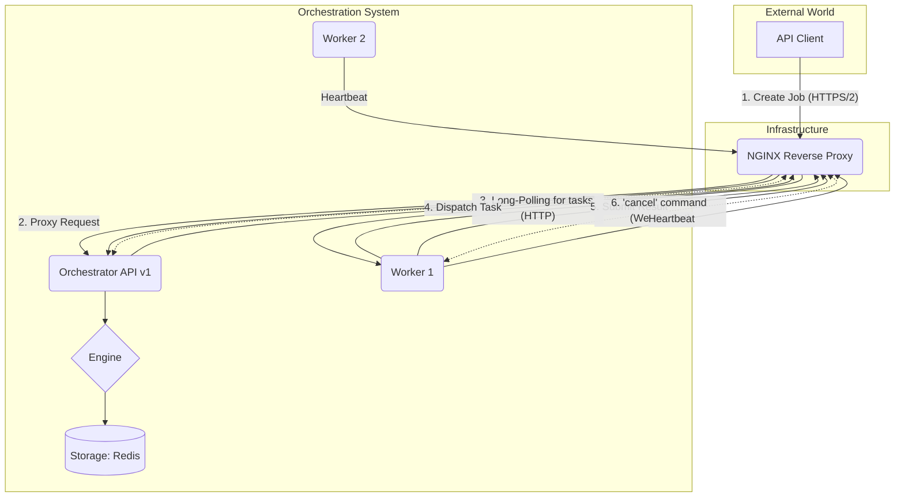

> **Note:** This document describes the **Python implementation** of the HLN standard. For the high-level architectural specification, please refer to the `hln` package.

**EN** | [ES](https://github.com/avtomatika-ai/avtomatika/blob/main/docs/es/architecture.md) | [RU](https://github.com/avtomatika-ai/avtomatika/blob/main/docs/ru/architecture.md)

# Orchestrator Architecture

This document describes the high-level architecture of the orchestration system, its key components, and their interaction.

## General Scheme

The system consists of a central **Orchestrator** and multiple **Workers**. 

### Component Diagram

```mermaid
graph TD
    subgraph "External World"
        Client[API Client]
    end

    subgraph "Infrastructure"
        NGINX(NGINX Reverse Proxy)
    end

    subgraph "Orchestration System"
        O_API(Orchestrator API v1)
        O_Engine{Engine}
        O_Storage[(Storage: Redis)]
        W1(Worker 1)
        W2(Worker 2)
    end

    Client --"1. Create Job (HTTPS/2)"--> NGINX
    NGINX --"2. Proxy Request"--> O_API
    O_API --> O_Engine
    O_Engine --> O_Storage

    W1 --"3. Long-Polling for tasks (HTTP)"--> NGINX
    NGINX --> O_API
    O_API --"4. Dispatch Task"--> NGINX
    NGINX --> W1

    W1 --"5. Submit Result"--> NGINX

    W1 <-."6. 'cancel' command (WebSocket)".-> NGINX
    NGINX <-." ".-> O_API

    W1 --"Heartbeat"--> NGINX
    W2 --"Heartbeat"--> NGINX
```

## High-Performance Principles

Avtomatika is optimized for maximum throughput and low latency:

1.  **Non-Blocking Everything**:
    *   **Logging**: Uses `QueueHandler` to offload log formatting and I/O to a background thread, preventing Event Loop stalls.
    *   **Serialization**: Heavy `msgpack` packing/unpacking for job states is offloaded to a **Thread Pool** via `run_in_executor`.
    *   **Webhooks**: Dispatched via a parallel worker pool to prevent slow external services from blocking the orchestrator.

2.  **Atomic Data Operations**:
    *   Critical sections (Heartbeat merge, load increment, work stealing) are implemented as **Lua scripts** in Redis.
    *   Uses **EVALSHA** to minimize network overhead by caching scripts on the Redis server.

3.  **Scalable Algorithms**:
    *   **O(1) Worker Lookup**: Uses Redis Set intersections (`SINTER`) to find idle workers.
    *   **O(1) Work Stealing**: Randomly samples a subset of workers (`SRANDMEMBER`) to steal tasks from, avoiding full index scans.
    *   **Batching**: Schedulers use `MGET` to check multiple job intervals in a single round-trip.

4.  **Backpressure & Resilience**:
    *   **`EXECUTOR_MAX_CONCURRENT_JOBS`**: Configurable semaphore (default 1000) limits active job handlers.
    *   **Heartbeat Jitter**: Prevents "Thundering Herd" effects after orchestrator restarts by staggering worker check-ins.

## Key Orchestrator Components

### 1. `OrchestratorEngine`
**Location:** `src/avtomatika/engine.py`

The central coordinator that:
*   Manages lifecycle of background processes.
*   Monitors **Event Loop Lag** via `orchestrator_loop_lag_seconds`.
*   Routes RXON protocol messages to the `WorkerService`.

### 2. `Blueprint`
**Location:** `src/avtomatika/blueprint.py`

A declarative state machine definition. Supports parallel task execution and result aggregation.

### 3. `Dispatcher`
**Location:** `src/avtomatika/dispatcher.py`

The intelligent router that:
*   Matches task requirements against worker capabilities.
*   Uses a **short-lived memory cache** for worker data to avoid redundant Redis hits.
*   Limits candidate searches via `DISPATCHER_MAX_CANDIDATES`.

### 4. `StorageBackend`
**Location:** `src/avtomatika/storage/`

*   **RedisStorage**: Primary high-performance backend using Streams for task delivery and Msgpack for state.
*   **HistoryStorage**: Archival layer (PostgreSQL/SQLite) with optimized indices on `worker_id` and `timestamp`.

## Security

*   **mTLS**: Mutual TLS for worker authentication.
*   **STS**: Security Token Service for rotating access tokens.
*   **Token Hashing**: Token hashes are cached in memory to minimize CPU usage during authentication.

## Detailed Documentation

- [**API Reference**](api_reference.md)
- [**Configuration Guide**](configuration.md)
- [**Deployment Guide**](deployment.md)
