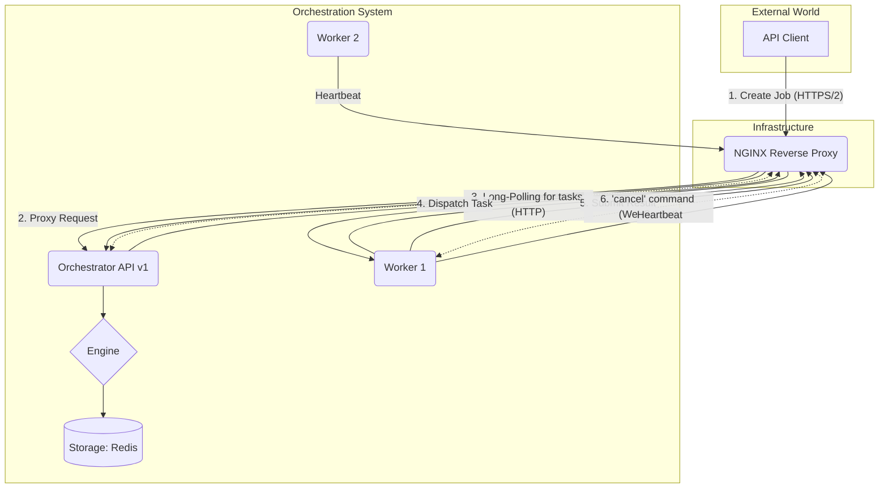

> **Note:** This document describes the **Python implementation** of the HLN standard. For the high-level architectural specification, please refer to the `hln` package.

**EN** | [ES](https://github.com/avtomatika-ai/avtomatika/blob/main/docs/es/architecture.md) | [RU](https://github.com/avtomatika-ai/avtomatika/blob/main/docs/ru/architecture.md)

# Orchestrator Architecture

This document describes the high-level architecture of the orchestration system, its key components, and their interaction.

## General Scheme

The system consists of a central **Orchestrator** and multiple **Workers**. 

### Component Diagram

```mermaid
graph TD
    subgraph "External World"
        Client[API Client]
    end

    subgraph "Infrastructure"
        NGINX(NGINX Reverse Proxy)
    end

    subgraph "Orchestration System"
        O_API(Orchestrator API v1)
        O_Engine{Engine}
        O_Storage[(Storage: Redis)]
        W1(Worker 1)
        W2(Worker 2)
    end

    Client --"1. Create Job (HTTPS/2)"--> NGINX
    NGINX --"2. Proxy Request"--> O_API
    O_API --> O_Engine
    O_Engine --> O_Storage

    W1 --"3. Long-Polling for tasks (HTTP)"--> NGINX
    NGINX --> O_API
    O_API --"4. Dispatch Task"--> NGINX
    NGINX --> W1

    W1 --"5. Submit Result"--> NGINX

    W1 <-."6. 'cancel' command (WebSocket)".-> NGINX
    NGINX <-." ".-> O_API

    W1 --"Heartbeat"--> NGINX
    W2 --"Heartbeat"--> NGINX
```

## High-Performance Principles

Avtomatika is optimized for maximum throughput and low latency:

1.  **Non-Blocking Everything**:
    *   **Logging**: Uses `QueueHandler` to offload log formatting and I/O to a background thread, preventing Event Loop stalls.
    *   **Serialization**: Heavy `msgpack` packing/unpacking for job states is offloaded to a **Thread Pool** via `run_in_executor`.
    *   **Webhooks**: Dispatched via a parallel worker pool to prevent slow external services from blocking the orchestrator.

2.  **Atomic Data Operations**:
    *   Critical sections (Heartbeat merge, load increment, work stealing) are implemented as **Lua scripts** in Redis.
    *   Uses **EVALSHA** to minimize network overhead by caching scripts on the Redis server.

3.  **Scalable Algorithms & Protocols**:
    *   **Standardized Holon Matching**: Uses the formalized `rxon` protocol logic for matching task requirements to holon resources. Supports **Smart Numeric Comparison (GE)** for any property (RAM, VRAM, custom metrics).
    *   **S3 Hash Consistency**: Strict verification of S3 configuration compatibility between Orchestrator and Worker during registration to prevent "split-brain" storage issues.
    *   **Deep Normalization (Beta 20 Fix)**: To ensure 100% data integrity between Python and Redis Lua, the storage layer implements recursive msgpack unpacking. This prevents 'hanging' issues caused by nested binary artifacts.
    *   **O(1) Work Stealing**: Randomly samples a subset of workers to steal tasks from, avoiding full index scans. **Beta 21:** The system now ensures atomic updates of `assigned_worker_id` during pickup to prevent result mismatch.
    *   **ZSET Worker Indexing**: All worker indexes (skills, idle, all) use Redis Sorted Sets (ZSET) with expiration timestamps as scores. This allows the orchestrator to filter out stale or timed-out workers directly in Redis, ensuring 100% data consistency and atomic cleanup via `ZRANGEBYSCORE`.
    *   **Batching**: Schedulers use `MGET` to check multiple job intervals in a single round-trip.

4.  **Backpressure & Resilience**:
    *   **`EXECUTOR_MAX_CONCURRENT_JOBS`**: Configurable semaphore (default 1000) limits active job handlers.
    *   **Heartbeat Jitter**: Prevents "Thundering Herd" effects after orchestrator restarts by staggering worker check-ins (fully supported by SDK).

## Blob Storage Architecture

S3 integration is refactored into a pluggable **BlobProvider** system:
- **Provider Interface**: Defines standard operations like `upload`, `download`, `get_metadata`, and `sign`.
- **Obstore Implementation**: Uses the Rust-based `obstore` library for high-speed, multi-threaded S3 interactions.
- **Task Isolation**: Each job has a dedicated S3 prefix and local temporary directory managed by the `TaskFiles` helper.
- **Consistency**: Strict verification of S3 configuration compatibility between Orchestrator and Worker during registration to prevent "split-brain" storage issues.

## Security (Zero Trust Architecture)

Avtomatika implements a strict Zero Trust model for worker-orchestrator communication:
*   **Identity Chain Verification**: Every signal (Registration, Task Result, Event) is cryptographically verified using HMAC-SHA256 signatures in the `SecurityContext`. We don't just trust the last sender; we verify the origin.
*   **Replay Protection**: Mandatory `timestamp` in payloads with a sliding window check (60 seconds) to prevent message reuse.
*   **mTLS (Mutual TLS)**: Mandatory mutual authentication between Orchestrator and Workers using certificates.
*   **STS (Security Token Service)**: Automatic rotation of short-lived access tokens via the `/_worker/auth/token` endpoint.

## Key Orchestrator Components

### 1. `OrchestratorEngine`
**Location:** `src/avtomatika/engine.py`

The central coordinator that:
*   Manages lifecycle of background processes.
*   Monitors **Event Loop Lag** via `orchestrator_loop_lag_seconds`.
*   Routes RXON protocol messages to the `WorkerService`.

### 2. `Blueprint`
**Location:** `src/avtomatika/blueprint.py`

A declarative state machine definition. Supports parallel task execution and result aggregation.

### 3. `Dispatcher`
**Location:** `src/avtomatika/dispatcher.py`

The intelligent router that:
*   Matches task requirements against worker capabilities.
*   Uses a **short-lived memory cache** for worker data to avoid redundant Redis hits.
*   Limits candidate searches via `DISPATCHER_MAX_CANDIDATES`.

### 4. `StorageBackend`
**Location:** `src/avtomatika/storage/`

*   **RedisStorage**: Primary high-performance backend using Streams for task delivery and Msgpack for state.
*   **HistoryStorage**: Archival layer (PostgreSQL/SQLite) with optimized indices on `worker_id` and `timestamp`.

## Security

*   **mTLS**: Mutual TLS for worker authentication.
*   **STS**: Security Token Service for rotating access tokens.
*   **Token Hashing**: Token hashes are cached in memory to minimize CPU usage during authentication.

## Detailed Documentation

- [**API Reference**](api_reference.md)
- [**Configuration Guide**](configuration.md)
- [**Deployment Guide**](deployment.md)
