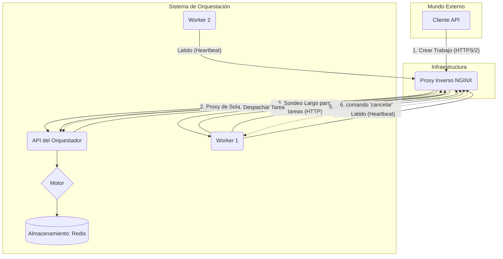

> **Nota:** Este documento describe la **implementación en Python** del estándar HLN. Para la especificación arquitectónica de alto nivel, consulta el paquete `hln`.

[EN](https://github.com/avtomatika-ai/avtomatika/blob/main/docs/architecture.md) | **ES** | [RU](https://github.com/avtomatika-ai/avtomatika/blob/main/docs/ru/architecture.md)

# Arquitectura del Orquestador

Este documento describe la arquitectura de alto nivel del sistema de orquestación, sus componentes clave y su interacción.

Como se presentó en `README.md`, la arquitectura se puede ver a través de la analogía **"Director-Guion-Intérpretes"**. Este documento detalla la implementación técnica de cada uno de estos elementos.

## Esquema General

El sistema consta de un **Orquestador** central y múltiples **Workers**. Todas las interacciones externas (de clientes y workers) pasan a través de **NGINX Reverse Proxy**, que proporciona soporte HTTP/2 y termina las conexiones TLS.

### Diagrama de Componentes


## Componentes Clave del Orquestador

### 0. Capa de Protocolo (`rxon`)
**Ubicación:** `src/avtomatika/protocol/`

Esta capa define el contrato estricto para la interacción del sistema, asegurando que la lógica comercial esté desacoplada de los detalles de transporte.
-   **Modelos:** Estructuras de datos (`WorkerRegistration`, `TaskResult`) definidas como `NamedTuple` (preparadas para el futuro para Pydantic/Protobuf).
-   **Seguridad**: Primitivas de seguridad independientes del transporte (fábricas SSLContext, Extracción de Identidad).
-   **Constantes**: Códigos de estado y tipos de error compartidos.

### 0.1 Capa de Servicio
**Ubicación:** `src/avtomatika/services/`

Encapsula la lógica comercial central, separándola de la API HTTP.
-   **`WorkerService`**: Gestiona el ciclo de vida del worker, registro, despacho de tareas, procesamiento de resultados y emisión de tokens STS.
-   **Manejadores de API**: Ahora actúan como envolturas delgadas que analizan las solicitudes HTTP y delegan a los Servicios.

### 1. `OrchestratorEngine`
**Ubicación:** `src/avtomatika/engine.py`

Esta es la clase central que une todos los componentes. Sus tareas principales:
- Inicializar la aplicación web `aiohttp` y delegar la configuración de rutas a la capa API.
- **Inicializar Servicios:** Arranca `WorkerService`, `S3Service`, etc.
- **Registrar "Blueprints":** Admite tanto el registro manual de `StateMachineBlueprint` como la carga automática desde un directorio especificado por `BLUEPRINTS_DIR`.
- Gestionar el ciclo de vida de los procesos en segundo plano (`JobExecutor`, `Watcher`, `HealthChecker`, `ReputationCalculator`, `Scheduler`).
- Proporcionar acceso a recursos compartidos a través de `aiohttp.web.AppKey`.

### 1.1. Capa API
**Ubicación:** `src/avtomatika/api/`

La lógica de manejo de la API HTTP se ha desacoplado del motor central para mejorar la mantenibilidad.
-   **`routes.py`**: Responsable de configurar la tabla de enrutamiento de la aplicación para las API de Cliente y Pública.
-   **`handlers.py`**: Contiene los manejadores de solicitudes reales para los puntos finales de Cliente y Público.
-   **API de Worker**: Ahora manejada por `HttpListener` de la librería `rxon`, que está integrada directamente en `OrchestratorEngine`. Este oyente gestiona los detalles HTTP de nivel inferior del protocolo RXON.

### 2. `StateMachineBlueprint`
**Ubicación:** `src/avtomatika/blueprint.py`

Esta es una forma declarativa de definir un flujo de trabajo (pipeline).
- **Máquina de Estados:** Cada blueprint representa una máquina de estados donde los estados son pasos del proceso y las transiciones se definen mediante la lógica dentro de los "manejadores".
- **Manejadores:** Funciones vinculadas a estados específicos utilizando el decorador `@blueprint.handler_for("state_name")`. Reciben `JobContext` y `ActionFactory` para realizar acciones.
- **Definición Explícita de Estado:** El decorador `@blueprint.handler_for` acepta dos banderas booleanas:
    - `is_start=True`: Marca el estado como **inicial**. Cada blueprint debe tener exactamente un estado de este tipo.
    - `is_end=True`: Marca el estado como **final** (terminal). Un blueprint puede tener múltiples estados de este tipo.
- **Validación:** Al registrar un blueprint en `OrchestratorEngine`, se llama automáticamente al método `validate()`, que comprueba que el blueprint tiene exactamente un estado inicial. Esto evita errores de configuración en una etapa temprana.
- **Condiciones:** Admite transiciones condicionales utilizando el modificador `.when("context.area.field == 'value'")`, lo que permite una lógica de enrutamiento flexible.
- **Visualización:** Proporciona un método `.render_graph()` para generar automáticamente un diagrama de estado utilizando `graphviz`, simplificando el análisis y la documentación de la lógica del pipeline.
- **Ejecución Paralela y Agregación:** Permite ejecutar múltiples tareas independientes simultáneamente. Al completarse, un manejador **agregador** especial recopila todos los resultados para su posterior procesamiento.

### 3. `JobExecutor`
**Ubicación:** `src/avtomatika/executor.py`

Este es el principal proceso en segundo plano responsable de ejecutar trabajos.
- **Bucle de Ejecución:** Recupera constantemente trabajos de la cola en Redis (`dequeue_job`).
- **Procesamiento de Trabajos:** Para cada trabajo, encuentra el manejador correspondiente en el blueprint y lo ejecuta.
- **Gestión de Estado:** Después de ejecutar el manejador, procesa las acciones solicitadas a través de `ActionFactory`. Esto puede ser una simple transición a un nuevo estado (`transition_to`) o una lógica más compleja, como despachar una tarea a un worker (`dispatch_task`).

  **Transiciones Asíncronas con `dispatch_task`**

  Una de las capacidades clave es gestionar un proceso que depende del resultado de una tarea asíncrona realizada por un worker. Esto se implementa utilizando el parámetro `transitions` en el método `dispatch_task`.

  ```python
  # Ejemplo de manejador
  async def generate_data_handler(context, actions):
      actions.dispatch_task(
          task_type="data_generation",
          params=context.initial_data,
          transitions={
              "success": "awaiting_approval",
              "failure": "data_generation_failed",
              "needs_review": "manual_review_step"
          }
      )
  ```

  En este ejemplo:
  1. El Orquestador despacha la tarea a un worker y guarda el diccionario `transitions` en el estado del `Job`.
  2. El `Job` pasa a un estado de espera (`waiting_for_worker`).
  3. El worker realiza la tarea y devuelve un resultado que contiene un estado (por ejemplo, `"success"`, `"failure"` o un estado personalizado `"needs_review"`).
  4. El Orquestador utiliza este estado como clave en el diccionario `transitions` guardado para determinar el siguiente estado.

  **Reglas de Comportamiento Importantes:**
  - **Estado Predeterminado:** Si el worker no devuelve un estado, el sistema predetermina a `"success"`.
  - **Transferencia de Datos del Worker:** Además del `status`, el worker puede devolver un objeto `data`. El contenido de este objeto (si es un diccionario) se copiará automáticamente a `context.state_history` y estará disponible en los pasos siguientes del blueprint.
  - **Estado Desconocido:** Si el worker devuelve un estado para el cual no hay clave en el diccionario `transitions`, el proceso pasa automáticamente a un estado llamado `"failed"`. Esto asegura la tolerancia a fallos y evita que los procesos se cuelguen.

- **Tolerancia a Fallos:** Implementa lógica de reintento y movimiento de tareas fallidas a cuarentena. El Orquestador maneja errores de los workers según su tipo, permitiendo una gestión flexible de tareas fallidas.

  **Tipos de Error Devueltos por el Worker:**
  Un worker puede devolver uno de tres tipos de error en el campo `error.code`:
  - `TRANSIENT_ERROR` (Predeterminado): Indica un problema temporal (por ejemplo, fallo de red, indisponibilidad de servicio externo). El Orquestador **reintentará** despachar la tarea varias veces antes de moverla a cuarentena.
  - `PERMANENT_ERROR`: Indica un problema permanente que no se resolverá reintentando (por ejemplo, archivo dañado, versión incompatible). La tarea se moverá inmediatamente a **cuarentena** sin reintentos.
  - `INVALID_INPUT_ERROR`: Indica un problema fundamental con los datos de entrada de la tarea (formato inválido, parámetros faltantes). El `Job` al que pertenece la tarea se moverá inmediatamente al estado **`failed`**, ya que la ejecución posterior no tiene sentido.

  **Mecanismos de Expiración (Timeouts):**
  El Orquestador admite dos tipos de tiempos de espera para las tareas:
  - **`dispatch_timeout`** (Tiempo de espera en cola): Tiempo máximo que una tarea puede esperar a un worker libre. Si ningún worker recoge la tarea en este tiempo, se cancela.
  - **`result_timeout`** (Plazo del resultado): Plazo absoluto para recibir el resultado desde el despacho. Si un worker recoge la tarea pero no devuelve un resultado antes de este momento, el resultado se ignora y la tarea se marca como fallida.

  **Niveles de Tolerancia a Fallos:**
  - **Reintento a Nivel de Tarea:** El Orquestador gestiona reintentos para `TRANSIENT_ERROR`.
  - **Reintento a Nivel de Trabajo:** Si ocurre una excepción en el propio código del manejador (en el Orquestador), `JobExecutor` reintentará ejecutar el mismo manejador varias veces antes de colocar todo el `Job` en cuarentena.

  **Ejecución Paralela de Tareas**

  El sistema permite ejecutar múltiples tareas en paralelo y luego recopilar sus resultados. Esto se logra mediante un uso especial del método `dispatch_task` y manejadores agregadores.

  1.  **Inicio de Ramas Paralelas:**
      - En un manejador, puedes llamar a `actions.dispatch_task` múltiples veces, cada vez para una tarea diferente.
      - **Punto Clave:** Todas estas llamadas `dispatch_task` deben tener el mismo paso siguiente (`transition`) que conduzca al manejador agregador.

      ```python
      # Manejador iniciando tareas paralelas
      @blueprint.handler_for("start_parallel_tasks")
      async def start_parallel_work(context, actions):
          # Despachar tarea A
          actions.dispatch_task(
              task_type="task_a",
              params={"id": 1},
              transitions={"success": "aggregate_results"}
          )
          # Despachar tarea B
          actions.dispatch_task(
              task_type="task_b",
              params={"id": 2},
              transitions={"success": "aggregate_results"}
          )
      ```
  2.  **Agregación de Resultados:**
      - El manejador destinado a recopilar resultados está marcado con el decorador especial `@blueprint.aggregator_for("state_name")`.
      - Este manejador se ejecutará solo **después de que TODAS las ramas paralelas que conducen a este estado estén completas**.
      - Dentro del agregador, los resultados de todas las tareas ejecutadas están disponibles a través de `context.aggregation_results`.

      ```python
      # Manejador agregador
      @blueprint.aggregator_for("aggregate_results")
      async def aggregator(context, actions):
          # Los resultados están disponibles como un diccionario: {task_id: result_dict}
          results = context.aggregation_results

          summary = {}
          for task_id, result in results.items():
              summary[task_id] = result.get("data")

          # Guardar resultado final y proceder
          context.state_history["summary"] = summary
          actions.transition_to("final_step")
      ```
      - `context.aggregation_results` es un diccionario donde las claves son IDs de tareas y los valores son objetos de resultado completos devueltos por los workers.

### 3.1. `JobContext` (Objeto de Contexto)
Cada manejador recibe un objeto `context` como entrada, que contiene toda la información necesaria sobre el trabajo actual y proporciona acceso a los recursos. Esta es la forma principal de acceder a los datos dentro del pipeline.

**Atributos Clave:**
- `context.job_id` (str): Identificador único del trabajo actual.
- `context.current_state` (str): Nombre del estado actual donde se ejecuta el manejador.
- `context.initial_data` (dict): Datos iniciales con los que se creó el trabajo.
- `context.state_history` (dict): Un diccionario donde puedes almacenar y leer datos persistentes dentro de un solo `Job`. Útil para pasar información entre estados.
- `context.aggregation_results` (dict): Disponible **solo en manejadores agregadores**. Contiene resultados de todas las tareas paralelas que se ejecutaron antes de la agregación. Las claves son `task_id`, los valores son diccionarios de resultados.
- `context.client` (ClientConfig): Objeto que contiene información sobre el cliente que inició el trabajo (incluido su plan y parámetros personalizados de `clients.toml`).
- `context.data_stores` (namespace): Objeto que proporciona acceso a todos los `data_store` adjuntos al blueprint. El acceso es por nombre, por ejemplo, `context.data_stores.my_cache.get("key")`.
- `context.tracing_context` (dict): Diccionario con información para el rastreo distribuido de OpenTelemetry.

### 3.2. `ActionFactory` (Fábrica de Acciones)
Como segundo argumento, cada manejador recibe un objeto `actions`. Este objeto proporciona métodos mediante los cuales el manejador determina qué debe suceder después de su ejecución. **Solo se puede llamar a un** método `actions` dentro de un solo manejador.

**Métodos Clave:**
- `actions.transition_to(state: str)`: Simplemente transiciona la máquina de estados al siguiente estado. La ejecución continuará inmediatamente.
- `actions.dispatch_task(task_type, params, transitions, priority, ...)`: Despacha una tarea para su ejecución a un worker y pausa el pipeline hasta que se reciba un resultado. El diccionario `transitions` determina a qué estado pasará el pipeline dependiendo del `status` devuelto por el worker. El parámetro `priority` permite especificar la prioridad de la tarea.
- `actions.await_human_approval(message, transitions)`: Pausa el pipeline hasta que un sistema externo o humano envíe un webhook con una decisión.
- `actions.run_blueprint(blueprint_name, initial_data, transitions)`: Ejecuta otro blueprint (secundario) como parte del pipeline actual. El pipeline principal se pausará hasta que el secundario se complete.

### 3.3. Inyección de Dependencias (`DataStore`)
El sistema admite un mecanismo de inyección de dependencias que permite proporcionar a los manejadores acceso a recursos externos, como clientes de bases de datos, clientes de API o cachés.

- **Registro:** Cualquier objeto (por ejemplo, una instancia de cliente `redis.Redis` o un cliente API personalizado) se puede registrar como un `DataStore` al crear un blueprint.
  ```python
  # Ejemplo de registro
  from .datastore import AsyncDictStore

  my_cache = AsyncDictStore({"initial_key": "initial_value"})

  bp = StateMachineBlueprint(
      "my_blueprint_with_datastore",
      data_stores={"cache": my_cache}
  )
  ```
- **Acceso en Manejador:** Los `DataStores` registrados están disponibles dentro de cualquier manejador de este blueprint a través del objeto `context`. El acceso es por el nombre especificado durante el registro.
  ```python
  @bp.handler_for("some_state")
  async def my_handler(context, actions):
      # Acceder a nuestra caché
      value = await context.data_stores.cache.get("some_key")
      print(f"Valor desde caché: {value}")
  ```

Este mecanismo permite desacoplar la lógica del proceso comercial de implementaciones específicas de clientes de acceso a datos, simplificando las pruebas y la reutilización de componentes.

### 4. Despachador (Dispatcher)
**Ubicación:** `src/avtomatika/dispatcher.py`

Responsable de asignar tareas al worker más adecuado.
- **Búsqueda de Worker O(1):** Utiliza intersecciones de **Conjuntos de Redis** (`SINTER`) para encontrar instantáneamente workers inactivos capaces de realizar un tipo de tarea específico. Esto reemplaza el escaneo O(N) y garantiza un rendimiento de tiempo constante incluso con miles de workers.
- **Filtrado:**
    1. **Estado y Tipo de Tarea:** Manejado instantáneamente a través de la indexación de Redis.
    2. **Requisitos de Recursos:** Filtra los candidatos resultantes por especificaciones de hardware (modelo de GPU, VRAM, modelos ML instalados).
- **Estrategias:** Aplica uno de los siguientes algoritmos de selección al grupo final de candidatos:
    - `default`: Prefiere workers "calientes" (con modelos requeridos en memoria), luego selecciona el más barato.
    - `round_robin`: Distribuye la carga secuencialmente.
    - `least_connections`: Selecciona el worker con el menor recuento de tareas activas.
    - `cheapest`: Selecciona el worker con el menor `cost_per_second`.
    - `best_value`: Selecciona el worker con la mejor relación precio/calidad usando su **reputación**.
- **Encolado:** Coloca la tarea en la cola de prioridad del worker en el Almacenamiento.

### 4.1. Interacción con el Worker (Modelo Pull)

El sistema utiliza un **Modelo Pull**, donde los workers inician la conexión con el orquestador para recibir tareas. Esto permite que los workers estén detrás de NAT o firewalls.

- **Registro y Latidos (Heartbeats):** El worker se registra con el orquestador al inicio, informando sus capacidades. Luego envía periódicamente mensajes de latido para confirmar la actividad. Este mecanismo sigue siendo el mismo.
- **Recuperación de Tareas (Long-Polling):**
    1. El worker envía una solicitud `GET` al punto final `/_worker/workers/{worker_id}/tasks/next`.
    2. Si ya hay una tarea en la cola para este worker (en Redis), el orquestador la devuelve inmediatamente en una respuesta `200 OK`.
    3. Si no hay tareas, el orquestador mantiene la conexión abierta (long-polling) durante un cierto tiempo de espera (por ejemplo, 30 segundos).
    4. Si durante este tiempo el `Dispatcher` coloca una tarea en la cola para este worker, se envía inmediatamente al worker que espera.
    5. Si el tiempo de espera expira y no aparecieron tareas, el orquestador responde `204 No Content`, y el worker realiza inmediatamente una nueva solicitud.
- **HealthChecker Pasivo:** El componente `HealthChecker` permanece pasivo. La "salud" del worker se determina por la presencia de mensajes de latido actuales en Redis (a través del mecanismo TTL). Si un worker deja de enviarlos, se considera automáticamente inactivo y se excluye del despacho.

#### **Tolerancia a Fallos y Equilibrio de Carga en el Lado del Worker**

Para aumentar la fiabilidad y la distribución de carga, `worker_sdk` admite la conexión a múltiples Orquestadores. Este comportamiento se configura en el lado del worker y es transparente para el Orquestador.

-   **Configuración:** Se pasa una lista de direcciones de Orquestador al worker a través de la variable de entorno `ORCHESTRATORS_CONFIG`.
-   **Modos de Operación (`MULTI_ORCHESTRATOR_MODE`):**
    -   `FAILOVER` (modo predeterminado): El worker sondeará constantemente el primer Orquestador de la lista. Si la solicitud falla (por ejemplo, debido a un fallo de red o indisponibilidad del servidor), cambia inmediatamente al siguiente Orquestador de la lista y continúa sondeándolo. Esto asegura alta disponibilidad.
    -   `ROUND_ROBIN`: El worker envía solicitudes de tareas secuencialmente a cada Orquestador de la lista. Este modo es útil para el escalado horizontal y la distribución de carga entre múltiples instancias de Orquestador independientes.
-   **Registro:** Al inicio, el worker se registra y envía mensajes de latido a *todos* los Orquestadores de la lista para que cada uno esté al tanto de su estado y capacidades.

### 4.2. Comunicación Avanzada: WebSocket

Además del modelo Pull para la recuperación de tareas, el sistema admite un canal de **comunicación bidireccional opcional a través de WebSocket**.

- **Iniciación:** El worker, si admite esta característica (y está habilitada a través de `WORKER_ENABLE_WEBSOCKETS=true`), establece una conexión WebSocket persistente con el Orquestador.
- **Propósito:**
    - **Comandos del Orquestador:** El Orquestador puede enviar comandos al worker en tiempo real. Un ejemplo principal es el comando para cancelar una tarea en ejecución (`cancel_task`).
    - **Actualizaciones del Worker:** El worker puede usar el mismo canal para enviar actualizaciones intermedias sobre el progreso de la tarea (`progress_update`).
- **Tolerancia a Fallos:** El SDK del worker gestiona automáticamente la reconexión en caso de pérdida de conexión.

Este modelo híbrido (HTTP para tareas, WebSocket para comandos y actualizaciones) permite combinar la fiabilidad y simplicidad del modelo Pull con la interactividad de las notificaciones Push.

### 5. `Watcher`
**Ubicación:** `src/avtomatika/watcher.py`

Un proceso en segundo plano que vigila las tareas "atascadas" o que han superado el tiempo de espera.
- **Seguimiento:** Comprueba un conjunto ordenado en Redis que contiene `job_id` y sus tiempos de espera.
- **Manejo de Tiempo de Espera:** Si una tarea ha excedido el tiempo de espera, `Watcher` la mueve al estado `failed` para evitar el bloqueo del sistema.

### 6. `ReputationCalculator`
**Ubicación:** `src/avtomatika/reputation.py`

Este proceso en segundo plano es responsable de analizar el rendimiento del worker y calcular su puntuación de reputación.
- **Análisis de Historial:** Consulta periódicamente `HistoryStorage` para tareas completadas por cada worker.
- **Cálculo:** Calcula una puntuación (0 a 1) basada en la relación éxito/fallo.
- **Actualización de Estado:** Guarda la nueva reputación en `StorageBackend`.
- **Throttling:** Utiliza un retraso aleatorio y limita las consultas a la base de datos para evitar picos de carga.

### 7. `HealthChecker`
**Ubicación:** `src/avtomatika/health_checker.py`

Proceso de mantenimiento activo.
- **Limpieza de Índices:** Escanea periódicamente los índices de Redis en busca de IDs de workers "muertos" (cuya clave de información principal ha expirado) y los elimina. Esto evita la hinchazón del índice y asegura que el Despachador O(1) siga siendo eficiente durante largos períodos de operación.
- **Bloqueo Distribuido:** Asegura que solo una instancia realice la limpieza en un clúster.

### 8. `Scheduler`
**Ubicación:** `src/avtomatika/scheduler.py`

Un proceso en segundo plano que activa trabajos basados en un horario definido en `schedules.toml`.
-   **Disparadores:** Admite disparadores de intervalo (cada N segundos), diarios, semanales y mensuales.
-   **Zonas Horarias:** Consciente de la zona horaria configurada globalmente (`TZ`).
-   **Bloqueo Distribuido:** Utiliza bloqueos atómicos en `StorageBackend` (`set_nx_ttl`) para asegurar que un trabajo programado se ejecute exactamente una vez en todas las instancias del Orquestador.
-   **Integración:** Crea trabajos directamente a través de `OrchestratorEngine.create_background_job`, eludiendo la API HTTP pero registrando eventos de creación en el historial.

### 9. `StorageBackend`
**Ubicación:** `src/avtomatika/storage/`

Abstracción para almacenar todos los estados **actuales** de trabajos, workers y colas.

-   **Implementaciones:**
    -   **`MemoryStorage` (predeterminado):** Implementación que almacena todos los datos en memoria. Implementación predeterminada si no se configura otro almacenamiento. Permite ejecutar la aplicación sin dependencias externas, pero todos los estados se pierden al reiniciar.
    -   **`RedisStorage` (recomendado para producción):** Implementación que utiliza Redis para almacenamiento persistente. Se activa cuando se especifica `REDIS_HOST` en la configuración.
        -   **Almacenamiento de Estado:** Utiliza `msgpack` para una serialización binaria eficiente de estados de trabajos y workers.
        -   **Colas de Tareas:** Utiliza **Redis Streams** (Grupos de Consumidores) para asegurar una entrega de tareas fiable (Al menos una vez). Soporta la recuperación de mensajes pendientes al reiniciar usando `INSTANCE_ID`.
-   **Interfaz:** `storage/base.py` define los métodos que deben implementarse en cualquier implementación de almacenamiento.

### 9.1. HistoryStorage
**Ubicación:** `src/avtomatika/history/`

Componente opcional para archivar cada evento en el ciclo de vida de un trabajo para análisis y depuración.

- **Búfer Asíncrono:** Utiliza una `asyncio.Queue` interna y un worker en segundo plano. Esto asegura que el bucle de ejecución principal nunca sea bloqueado por la latencia de la base de datos.
- **Backends:**
    - **SQLite**: (URI: `sqlite:path/to/db`).
        - Almacena marcas de tiempo como tiempo Unix (REAL) en UTC para ordenar.
        - Convierte automáticamente la hora a `TZ` global en la recuperación.
    - **PostgreSQL**: (URI: `postgresql://...`).
        - Utiliza `TIMESTAMPTZ` nativo.
        - Maneja campos `JSONB` para instantáneas de contexto.
- **Eventos Registrados:** `state_started`, `state_finished`, `state_failed`, `task_dispatched`.
- **Seguridad ante Fallos:** Los errores durante el registro se registran pero no interrumpen la ejecución del trabajo.

### 9.2. Acceso al Grafo del Blueprint

Para fines de visualización y depuración, el sistema proporciona un punto final para recuperar la estructura de cualquier blueprint registrado como un grafo.

-   **Punto final:** `GET /api/v1/blueprints/{blueprint_name}/graph`
-   **Descripción:** Devuelve una representación textual del grafo del blueprint especificado en formato DOT (lenguaje de descripción de grafos). Este formato se puede renderizar en una imagen utilizando la utilidad Graphviz o librerías JavaScript compatibles (por ejemplo, `viz.js`).
-   **Parámetros de Ruta:**
    -   `blueprint_name` (cadena): Nombre del blueprint cuyo grafo se necesita recuperar.
-   **Respuesta Exitosa (200 OK):**
    -   **Content-Type:** `text/vnd.graphviz`
    -   **Cuerpo de Respuesta:** Cadena en formato DOT que describe el grafo.
-   **Errores Posibles:**
    -   `404 Not Found`: Si no se encuentra el blueprint con el nombre especificado.
    -   `501 Not Implemented`: Si la utilidad `graphviz` requerida para la generación del grafo no está instalada en el servidor del orquestador.

## 10. Autenticación y Autorización

El sistema utiliza un procesamiento de dos niveles de las solicitudes entrantes: primero carga de configuración, y luego aplicación de una cadena de `middlewares` para autenticación y autorización.

### 10.1. Carga de Configuración del Cliente
**Ubicación:** `src/avtomatika/client_config_loader.py`

Al inicio de la aplicación, un módulo especial `client_config_loader` realiza las siguientes acciones:
1.  **Lectura de `clients.toml`:** Lee el archivo de configuración `clients.toml` que contiene información sobre todos los clientes permitidos.
2.  **Carga en Redis:** Para cada cliente en el archivo:
    -   Guarda su configuración estática (plan, límites, parámetros personalizados) en Redis utilizando el token del cliente como clave.
    -   Si se define una cuota (`monthly_attempts`) para el cliente, inicializa el contador correspondiente en Redis.

Este proceso se ejecuta una vez al inicio, evitando la lectura de archivos en cada solicitud y asegurando un alto rendimiento.

### 10.2. Middlewares

Todas las solicitudes a puntos finales protegidos pasan a través de una cadena de `middlewares`.

#### **Autenticación de Cliente (`client_auth_middleware`)**
- **Tarea:** Verificar que el cliente está autorizado para acceder al sistema.
- **Mecanismo:**
    1.  Extrae el token del encabezado `X-Client-Token`.
    2.  Busca la configuración por este token en Redis.
    3.  Si se encuentra la configuración, se adjunta al objeto `request` (en `request["client_config"]`) para su uso por middlewares posteriores en la cadena.
    4.  Si el token es inválido, la solicitud se rechaza con estado `401 Unauthorized`.

#### **Autenticación de Worker**
- **Tarea:** Verificar que la solicitud proviene de un worker autenticado.
- **Mecanismo:** Manejado a través del despachador `handle_rxon_message` llamando a `verify_worker_auth`. Soporta un modelo híbrido:
    1.  **Extracción de Identidad**: Extrae automáticamente la identidad de los certificados mTLS (Nombre Común) o tokens STS de corta duración.
    2.  **Verificación de Token Individual (Prioridad):** Busca en Redis un token vinculado al `worker_id` específico.
    3.  **Verificación de Token Global (Respaldo):** Recurre al `WORKER_TOKEN` general si no se encuentra el token individual.
    4.  Si todas las comprobaciones fallan, la solicitud se rechaza con estado `401 Unauthorized`.
- **Configuración:** Los tokens individuales se definen en el archivo `workers.toml` y se cargan en Redis al inicio del Orquestador.

#### **Verificación de Cuota (`quota_middleware`)**
- **Tarea:** Asegurar que el cliente no ha excedido su límite de solicitudes.
- **Mecanismo:**
    1.  Se ejecuta **después** de `client_auth_middleware`.
    2.  Utiliza `token` de la configuración del cliente adjunta (`request["client_config"]`).
    3.  Ejecuta la operación atómica `check_and_decrement_quota` en Redis.
    4.  Si la cuota se agota, la solicitud se rechaza con estado `429 Too Many Requests`.

#### **Limitación de Velocidad (`ratelimit_middleware`)**
- **Tarea:** Proteger el sistema de solicitudes demasiado frecuentes de una sola fuente (ataques DDoS, clientes "ruidosos").
- **Mecanismo:**
    1.  Utiliza la dirección IP del cliente o `worker_id` como clave de seguimiento.
    2.  Para cada solicitud, incrementa atómicamente un contador en Redis con un TTL especificado (por ejemplo, 5 solicitudes por minuto).
    3.  Si el contador excede el límite, la solicitud se rechaza con estado `429 Too Many Requests`.

#### **Compresión de Respuesta (`compression_middleware`)**
- **Tarea:** Reducir el tamaño del cuerpo de la respuesta para ahorrar tráfico.
- **Mecanismo:**
    1.  Comprueba el encabezado `Accept-Encoding` en la solicitud del cliente.
    2.  Si el cliente admite `zstd` (preferido) o `gzip`, el cuerpo de la respuesta se comprime antes de enviar.
    3.  Añade el encabezado `Content-Encoding` indicando el algoritmo utilizado.

## 11. Escalado Horizontal (Alta Disponibilidad)

La arquitectura del sistema permite ejecutar múltiples instancias del Orquestador en paralelo para asegurar tolerancia a fallos y distribución de carga.

-   **API Sin Estado:** La API HTTP es completamente sin estado. Todos los datos sobre tareas y workers se almacenan en Redis. Esto permite que un balanceador de carga (por ejemplo, NGINX) distribuya las solicitudes entre cualquier número de instancias del Orquestador.
-   **Bloqueo Distribuido:** Procesos en segundo plano como `Watcher` (verificación de tiempo de espera) y `ReputationCalculator` (cálculo de reputación) utilizan un mecanismo de bloqueo distribuido para garantizar que el trabajo sea realizado por solo una instancia en un momento dado.
    -   **Mecanismo:** Utiliza la operación atómica de Redis `SET key value NX PX ttl`.
    -   **Comportamiento:** Al inicio del ciclo, la tarea en segundo plano intenta adquirir un bloqueo global. Si el bloqueo ya lo tiene otra instancia activa, la instancia actual omite la iteración. Esto evita condiciones de carrera y duplicación de operaciones.

## 12. Log y Observabilidad

Avtomatika está construida para entornos modernos nativos de la nube con observabilidad profunda.

- **Log Estructurado JSON:** Por defecto, el sistema utiliza `python-json-logger` para emitir logs en formato JSON, listos para ELK, Loki u otros agregadores de logs.
- **Conciencia de Zona Horaria:** Todas las marcas de tiempo en los logs, la API de historial y los disparadores del programador respetan la configuración global `TZ`.
- **Trazabilidad:** Cada entrada de log producida durante la ejecución del trabajo incluye automáticamente `job_id`, y donde corresponda, `worker_id` y `task_id`.
- **Limitación de Velocidad Global:** Un limitador de velocidad basado en Redis protege todos los puntos de entrada (API Pública, Cliente y Worker). Utiliza límites conscientes del contexto (por ejemplo, más alto para latidos, más bajo para sondeo) para garantizar la estabilidad.

## 13. Recomendaciones de Despliegue y Escalado

Para asegurar un funcionamiento fiable y eficaz del sistema en producción, se recomiendan las siguientes prácticas:

- **Proxy Inverso y HTTP/2 (Enfoque Recomendado):** Para máximo rendimiento y seguridad, despliega el Orquestador detrás de un Proxy Inverso como NGINX. Esto proporciona dos beneficios clave:
    1.  **Soporte HTTP/2:** El servidor proxy maneja la terminación de conexión HTTP/2, reduciendo significativamente la latencia y la sobrecarga de red mediante la multiplexación de solicitudes. Especialmente efectivo para latidos frecuentes de workers.
    2.  **Seguridad y Escalado:** El Orquestador está aislado del acceso externo directo. El servidor proxy también puede actuar como Balanceador de Carga (L7), distribuyendo solicitudes entre múltiples instancias del Orquestador, y manejar la terminación TLS (HTTPS).

    El repositorio proporciona un ejemplo de despliegue listo para usar utilizando NGINX y Docker Compose, que es la forma recomendada de ejecutar el sistema.

- **Validación Estricta de Configuración:** El sistema implementa el principio **Fail Fast**. Al inicio, el Orquestador valida los archivos de configuración (`clients.toml`, `workers.toml`). Si se encuentran errores (TOML inválido, campos obligatorios faltantes), la aplicación **no se iniciará**, lanzando una excepción. Esto evita ejecutar el sistema en un estado incorrecto o inseguro.

- **Modernización del Transporte (WebSocket):** Para tareas que requieren intercambio de datos en tiempo real (por ejemplo, cancelación de tareas o envío de progreso intermedio), el sistema admite un canal WebSocket opcional. La conexión también debe establecerse a través de Proxy Inverso.

- **Compresión de Respuesta:** La compresión se implementa a nivel de aplicación utilizando un middleware personalizado que admite **Zstandard** (preferido) y **Gzip** (como respaldo). No es necesario habilitar compresión adicional a nivel de balanceador de carga.

- **Limitación de Velocidad:** Se recomienda configurar una limitación básica en el balanceador de carga. Además, la aplicación implementa su propio mecanismo de limitación de velocidad más granular para puntos finales de workers (por ejemplo, para latidos), limitando la frecuencia de solicitudes para cada `worker_id`.

- **Alertas:** El sistema viene con un conjunto de reglas de alerta recomendadas para Prometheus. Estas reglas ayudan a rastrear eventos críticos, como la falta de workers activos o un alto porcentaje de fallos en trabajos.

## 13. Descarga de Carga Útil (Payload Offloading)

Para tareas que requieren gran transferencia de datos (archivos de video, conjuntos de datos), el sistema admite "Descarga de Carga Útil" para mantener Redis ligero.

- **Tecnología**: Construido sobre **`obstore`** (enlaces de Python para `object_store` de Rust), proporcionando acceso S3 asíncrono de alto rendimiento.
- **Seguridad de Memoria (Streaming)**:
    - Las descargas y cargas de archivos son completamente transmitidas por flujo (streamed).
    - Los datos se canalizan directamente entre el socket de red y el disco, asegurando que el uso de RAM permanezca bajo y constante (O(1)) independientemente del tamaño del archivo.
    - Esto evita errores de falta de memoria (OOM) incluso al procesar archivos de varios gigabytes.
- **Control de Concurrencia Global**:
    - Para proteger el sistema del agotamiento de descriptores de archivos bajo alta carga, las operaciones S3 están protegidas por un semáforo global (`S3_MAX_CONCURRENCY`).
- **Mecanismo**:
    1.  **Aislamiento**: Los archivos se almacenan en S3 bajo `jobs/{job_id}/`.
    2.  **Ciclo de Vida**:
        - El ayudante `TaskFiles` proporciona métodos (`download`, `upload`, `read_json`) que manejan automáticamente las rutas.
        - Limpieza automática: Cuando un trabajo alcanza un estado terminal (`finished`, `failed`), el Orquestador elimina el prefijo S3 y los archivos temporales locales.

## 14. Observabilidad

**Nota:** Las funciones de observabilidad (métricas y rastreo) son opcionales. Para activarlas, instala el proyecto con dependencia adicional: `pip install .[telemetry]`. Si no se instalan las dependencias, el sistema funcionará en modo normal pero sin recopilar ni proporcionar datos de telemetría.

El sistema está construido utilizando el estándar **OpenTelemetry**, asegurando un enfoque unificado para recopilar datos de operación.

### 14.1. Métricas
- **Tecnología:** Las métricas se recopilan utilizando `OpenTelemetry SDK` y se exponen para su recopilación por Prometheus a través del punto final `/_public/metrics`.
- **Implementación:**
    - **Instrumentos:** Definidos en `src/avtomatika/metrics.py` utilizando instrumentos estándar de OpenTelemetry (`Counter`, `Histogram`, `ObservableGauge`).
    - **Exportador:** `OrchestratorEngine` inicializa `PrometheusMetricReader`, que se registra automáticamente con `prometheus-client`.
    - **Devoluciones de llamada de Gauge:** Para métricas que no se pueden actualizar incrementalmente (por ejemplo, longitud de cola), se utiliza el mecanismo `ObservableGauge`. `OrchestratorEngine` ejecuta una tarea en segundo plano consultando periódicamente el almacenamiento y almacenando valores en caché. Las devoluciones de llamada de métricas síncronas luego devuelven instantáneamente estos valores en caché, evitando el bloqueo durante la recopilación de métricas.

### 14.2. Rastreo Distribuido
- **Tecnología:** El rastreo también se basa en `OpenTelemetry`.
- **Implementación:**
    - **Instrumentación:** El cliente `aiohttp` utilizado para la comunicación con workers se instrumenta automáticamente utilizando `AioHttpClientInstrumentor`.
    - **Propagación de Contexto:** El Orquestador pasa automáticamente el contexto de rastreo al worker en encabezados HTTP.
    - **Exportación:** El `OTLP Exporter` configurado permite enviar datos de rastreo a cualquier recopilador compatible (por ejemplo, OpenTelemetry Collector).
    - **Visualización:** Las trazas recopiladas se pueden visualizar en sistemas como Jaeger o Zipkin. Esto permite ver el ciclo de vida completo del trabajo como un diagrama de Gantt, analizando latencias y encontrando cuellos de botella en el sistema distribuido.
