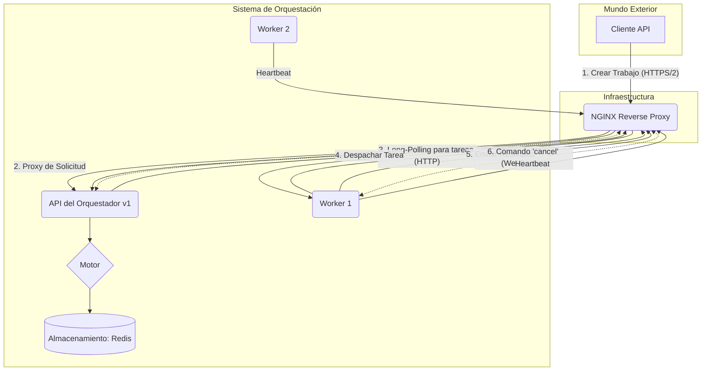

> **Nota:** Este documento describe la **implementación en Python** del estándar HLN. Para la especificación arquitectónica de alto nivel, consulte el paquete `hln`.

[EN](https://github.com/avtomatika-ai/avtomatika/blob/main/docs/architecture.md) | **ES** | [RU](https://github.com/avtomatika-ai/avtomatika/blob/main/docs/ru/architecture.md)

# Arquitectura del Orquestador

Este documento describe la arquitectura de alto nivel del sistema de orquestación, sus componentes clave y su interacción.

## Esquema General

El sistema consta de un **Orquestador** central y múltiples **Workers**. 

### Diagrama de Componentes

```mermaid
graph TD
    subgraph "Mundo Exterior"
        Client[Cliente API]
    end

    subgraph "Infraestructura"
        NGINX(NGINX Reverse Proxy)
    end

    subgraph "Sistema de Orquestación"
        O_API(API del Orquestador v1)
        O_Engine{Motor}
        O_Storage[(Almacenamiento: Redis)]
        W1(Worker 1)
        W2(Worker 2)
    end

    Client --"1. Crear Trabajo (HTTPS/2)"--> NGINX
    NGINX --"2. Proxy de Solicitud"--> O_API
    O_API --> O_Engine
    O_Engine --> O_Storage

    W1 --"3. Long-Polling para tareas (HTTP)"--> NGINX
    NGINX --> O_API
    O_API --"4. Despachar Tarea"--> NGINX
    NGINX --> W1

    W1 --"5. Enviar Resultado"--> NGINX

    W1 <-."6. Comando 'cancel' (WebSocket)".-> NGINX
    NGINX <-." ".-> O_API

    W1 --"Heartbeat"--> NGINX
    W2 --"Heartbeat"--> NGINX
```

## Principios de Alto Rendimiento

Avtomatika está optimizada para el máximo rendimiento y baja latencia:

1.  **Todo No Bloqueante**:
    *   **Logging**: Utiliza `QueueHandler` para delegar el formateo y la E/S a un hilo de fondo, evitando paradas del Event Loop.
    *   **Serialización**: El empaquetado/desempaquetado pesado de `msgpack` para los estados de los trabajos se delega a un **Pool de Hilos** vía `run_in_executor`.
    *   **Webhooks**: Se despachan a través de un pool de workers paralelos para evitar que servicios externos lentos bloqueen el orquestador.

2.  **Operaciones de Datos Atómicas**:
    *   Las secciones críticas (fusión de Heartbeat, incremento de carga, robo de tareas) se implementan como **scripts de Lua** en Redis.
    *   Utiliza **EVALSHA** para minimizar la sobrecarga de red al cachear los scripts en el servidor Redis.

3.  **Algoritmos Escalables**:
    *   **Búsqueda de Worker O(1)**: Utiliza intersecciones de conjuntos de Redis (`SINTER`) para encontrar workers inactivos al instante.
    *   **Robo de Tareas O(1)**: Muestrea aleatoriamente un subconjunto de workers (`SRANDMEMBER`) para robar tareas, evitando escaneos completos de índices.
    *   **Lotes**: Los programadores utilizan `MGET` para verificar múltiples intervalos de trabajos en un solo viaje de ida y vuelta.

4.  **Contrapresión y Resiliencia**:
    *   **`EXECUTOR_MAX_CONCURRENT_JOBS`**: Semáforo configurable (por defecto 1000) que limita los manejadores de trabajos activos.
    *   **Heartbeat Jitter**: Previene efectos de "Tormenta de Peticiones" (Thundering Herd) después de reinicios del orquestador escalonando los registros de los workers.

## Componentes Clave del Orquestador

### 1. `OrchestratorEngine`
**Ubicación:** `src/avtomatika/engine.py`

El coordinador central que:
*   Gestiona el ciclo de vida de los procesos en segundo plano.
*   Monitorea el **Lag del Event Loop** a través de `orchestrator_loop_lag_seconds`.
*   Enruta los mensajes del protocolo RXON al `WorkerService`.

### 2. `Blueprint`
**Ubicación:** `src/avtomatika/blueprint.py`

Una definición declarativa de máquina de estados. Soporta la ejecución de tareas en paralelo y la agregación de resultados.

### 3. `Dispatcher`
**Ubicación:** `src/avtomatika/dispatcher.py`

El enrutador inteligente que:
*   Compara los requisitos de la tarea con las capacidades del worker.
*   Utiliza una **caché de memoria de corta duración** para los datos del worker para evitar accesos redundantes a Redis.
*   Limita las búsquedas de candidatos vía `DISPATCHER_MAX_CANDIDATES`.

### 4. `StorageBackend`
**Ubicación:** `src/avtomatika/storage/`

*   **RedisStorage**: Backend principal de alto rendimiento que utiliza Streams para la entrega de tareas y Msgpack para el estado.
*   **HistoryStorage**: Capa de archivo (PostgreSQL/SQLite) con índices optimizados en `worker_id` y `timestamp`.

## Seguridad

*   **mTLS**: TLS mutuo para la autenticación de workers.
*   **STS**: Servicio de tokens de seguridad para rotar tokens de acceso.
*   **Hash de Tokens**: Los hashes de los tokens se cachean en memoria para minimizar el uso de CPU durante la autenticación.

## Documentación Detallada

- [**Referencia de API**](api_reference.md)
- [**Guía de Configuración**](configuration.md)
- [**Guía de Despliegue**](deployment.md)
