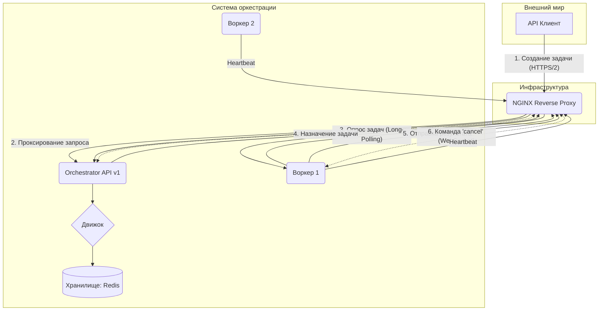

> **Примечание:** Этот документ описывает **Python-реализацию** стандарта HLN. Для ознакомления с высокоуровневой архитектурной спецификацией, пожалуйста, обратитесь к пакету `hln`.

[EN](https://github.com/avtomatika-ai/avtomatika/blob/main/docs/architecture.md) | [ES](https://github.com/avtomatika-ai/avtomatika/blob/main/docs/es/architecture.md) | **RU**

# Архитектура Оркестратора

Этот документ описывает высокоуровневую архитектуру системы оркестрации, её ключевые компоненты и их взаимодействие.

## Общая схема

Система состоит из центрального **Оркестратора** и множества **Воркеров**. 

### Диаграмма компонентов

```mermaid
graph TD
    subgraph "Внешний мир"
        Client[API Клиент]
    end

    subgraph "Инфраструктура"
        NGINX(NGINX Reverse Proxy)
    end

    subgraph "Система оркестрации"
        O_API(Orchestrator API v1)
        O_Engine{Движок}
        O_Storage[(Хранилище: Redis)]
        W1(Воркер 1)
        W2(Воркер 2)
    end

    Client --"1. Создание задачи (HTTPS/2)"--> NGINX
    NGINX --"2. Проксирование запроса"--> O_API
    O_API --> O_Engine
    O_Engine --> O_Storage

    W1 --"3. Опрос задач (Long-Polling)"--> NGINX
    NGINX --> O_API
    O_API --"4. Назначение задачи"--> NGINX
    NGINX --> W1

    W1 --"5. Отправка результата"--> NGINX

    W1 <-."6. Команда 'cancel' (WebSocket)".-> NGINX
    NGINX <-." ".-> O_API

    W1 --"Heartbeat"--> NGINX
    W2 --"Heartbeat"--> NGINX
```

## Принципы высокой производительности

Avtomatika оптимизирована для максимальной пропускной способности и минимальных задержек:

1.  **Полная асинхронность (Non-Blocking)**:
    *   **Логгирование**: Использование `QueueHandler` выносит форматирование и запись логов в фоновый поток, предотвращая замирания Event Loop.
    *   **Сериализация**: Тяжелые операции упаковки/распаковки `msgpack` для состояний задач вынесены в **Thread Pool** через `run_in_executor`.
    *   **Вебхуки**: Отправляются через пул параллельных воркеров, чтобы медленные внешние сервисы не блокировали оркестратор.

2.  **Атомарные операции с данными**:
    *   Критические секции (обновление статуса воркера, инкремент нагрузки, кража задач) реализованы в виде **Lua-скриптов** внутри Redis.
    *   Использование **EVALSHA** минимизирует сетевой оверхед за счет кэширования скриптов на стороне Redis.

3.  **Масштабируемые алгоритмы**:
    *   **O(1) Поиск воркера**: Использование пересечений множеств Redis (`SINTER`) для мгновенного поиска свободных исполнителей.
    *   **O(1) Work Stealing**: Случайная выборка подмножества воркеров (`SRANDMEMBER`) для кражи задач, что избавляет от полного сканирования индексов.
    *   **Пакетная обработка**: Планировщик использует `MGET` для проверки интервалов множества задач за один сетевой запрос.

4.  **Управление нагрузкой и устойчивость**:
    *   **`EXECUTOR_MAX_CONCURRENT_JOBS`**: Настраиваемый семафор (по умолчанию 1000) ограничивает количество активных обработчиков.
    *   **Heartbeat Jitter**: Предотвращает эффект «шторма запросов» (Thundering Herd) после рестарта оркестратора за счет разнесения времени пульса воркеров.

## Ключевые компоненты

### 1. `OrchestratorEngine`
**Локация:** `src/avtomatika/engine.py`

Центральный координатор, который:
*   Управляет жизненным циклом фоновых процессов.
*   Мониторит **задержку Event Loop** через метрику `orchestrator_loop_lag_seconds`.
*   Маршрутизирует сообщения протокола RXON в `WorkerService`.

### 2. `Blueprint`
**Локация:** `src/avtomatika/blueprint.py`

Декларативное определение конечного автомата. Поддерживает параллельное выполнение задач и агрегацию результатов.

### 3. `Dispatcher`
**Локация:** `src/avtomatika/dispatcher.py`

Интеллектуальный роутер, который:
*   Сопоставляет требования задач с возможностями воркеров.
*   Использует **краткосрочный кэш в памяти** для данных воркеров, чтобы избежать избыточных запросов к Redis.
*   Ограничивает глубину поиска кандидатов через `DISPATCHER_MAX_CANDIDATES`.

### 4. `StorageBackend`
**Локация:** `src/avtomatika/storage/`

*   **RedisStorage**: Основной бэкенд, использующий Streams для доставки задач и Msgpack для хранения состояний.
*   **HistoryStorage**: Слой архивации (PostgreSQL/SQLite) с оптимизированными индексами по `worker_id` и `timestamp`.

## Безопасность

*   **mTLS**: Взаимная TLS-аутентификация для воркеров.
*   **STS**: Security Token Service для ротации токенов доступа.
*   **Token Hashing**: Хэши токенов кэшируются в памяти для минимизации нагрузки на CPU при каждой проверке прав.

## Дополнительная документация

- [**Справочник API**](api_reference.md)
- [**Гайд по конфигурации**](configuration.md)
- [**Инструкции по развертыванию**](deployment.md)
